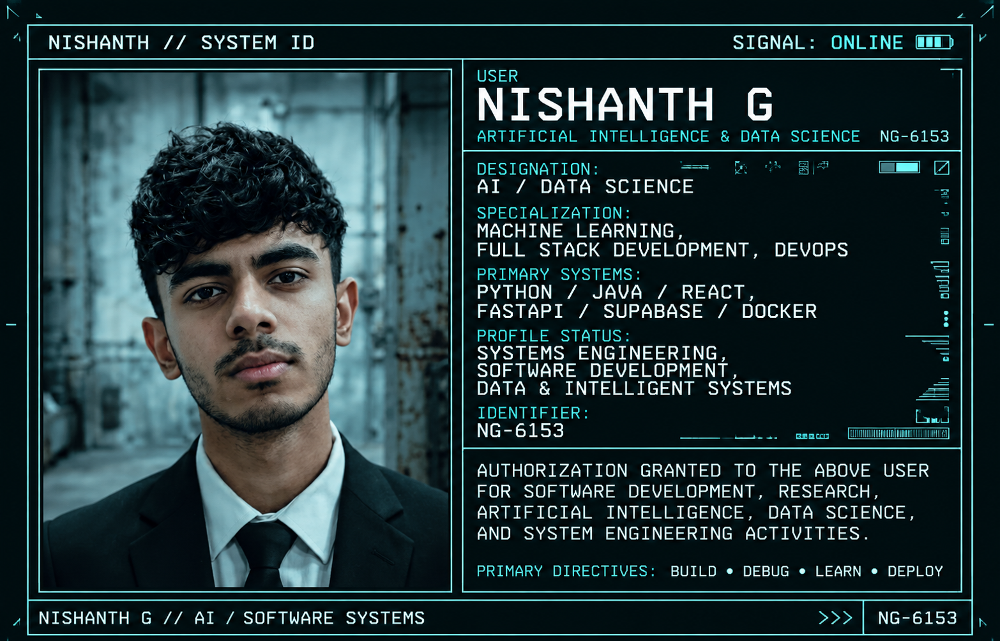

<div align="center">



<br>
<br>

# NISHANTH G

### Artificial Intelligence & Data Science Student • Full Stack Developer • AI/ML Enthusiast

<p>
  Building practical software systems by combining
  <b>Artificial Intelligence</b>, <b>Machine Learning</b>,
  <b>Data</b>, and <b>Full Stack Development</b>.
</p>

</div>

---

## ABOUT ME

I am a **B.Tech student specializing in Artificial Intelligence & Data Science**, with a strong interest in building practical and intelligent software systems.

I enjoy working across the stack — from **data preprocessing and machine learning** to **backend APIs, frontend applications, databases, deployment, and performance**.

My current focus is on strengthening my fundamentals while building real-world projects in:

- Artificial Intelligence & Machine Learning
- Data Structures & Algorithms
- Full Stack Development
- Backend Engineering
- Docker & DevOps
- System Design

I believe in learning by building:

**Understand → Design → Build → Test → Debug → Improve**

---

## TECH STACK

### PROGRAMMING LANGUAGES

<p>
  
</p>

### AI / MACHINE LEARNING / DATA

<p>
  
</p>

<p>
  
  
  
</p>

### FRONTEND

<p>
  
</p>

### BACKEND

<p>
  
</p>

### DATABASE

<p>
  
</p>

### DEVOPS / TOOLS

<p>
  
</p>

---

## ENGINEERING FOCUS

| AREA | FOCUS |
|---|---|
| Artificial Intelligence | Machine Learning, Neural Networks, Intelligent Systems |
| Data Science | Data Preprocessing, Analysis, Visualization |
| Algorithms | Data Structures & Algorithms, Problem Solving |
| Frontend | React, TypeScript, Vite, Tailwind CSS |
| Backend | Python, FastAPI, REST APIs |
| Databases | PostgreSQL, Supabase |
| DevOps | Docker, GitHub Actions, Deployment |
| Systems | Backend Architecture, Performance, System Design |

---

## FEATURED PROJECTS

### SMART CNC PRODUCTION SCHEDULER

An **Industry 5.0 production scheduling system** designed to intelligently schedule manufacturing jobs based on real-time production constraints.

**Key areas**

- Production order scheduling
- Machine compatibility
- Machine health
- Operator availability
- Material availability
- Queue management
- Dynamic rescheduling
- Scheduling validation
- Optimization

**Technology**

`React` `TypeScript` `FastAPI` `Python` `Supabase`

---

### DAYFLOW HRMS

A modern **Human Resource Management System** designed to manage employees, attendance, leave, payroll and organizational workflows.

**Key areas**

- Authentication
- Employee management
- Attendance
- Check-in / Check-out
- Leave requests
- Leave approval
- Payroll
- Notifications
- Analytics & reports

**Technology**

`React` `TypeScript` `FastAPI` `Python` `Supabase`

---

### STRIDE HABIT TRACKER

A full-stack habit tracking platform focused on consistency, progress visualization and user engagement.

**Features**

- Habit categories
- Daily check-ins
- Streak tracking
- Progress charts
- Badges
- Reminders
- Dashboard
- Profile management

**Technology**

`React` `JavaScript` `Python`

---

## CURRENTLY LEARNING

```text
Data Structures & Algorithms
Machine Learning
Deep Learning
System Design
Backend Architecture
Docker
DevOps
Cloud Technologies
Database Design
Software Engineering
